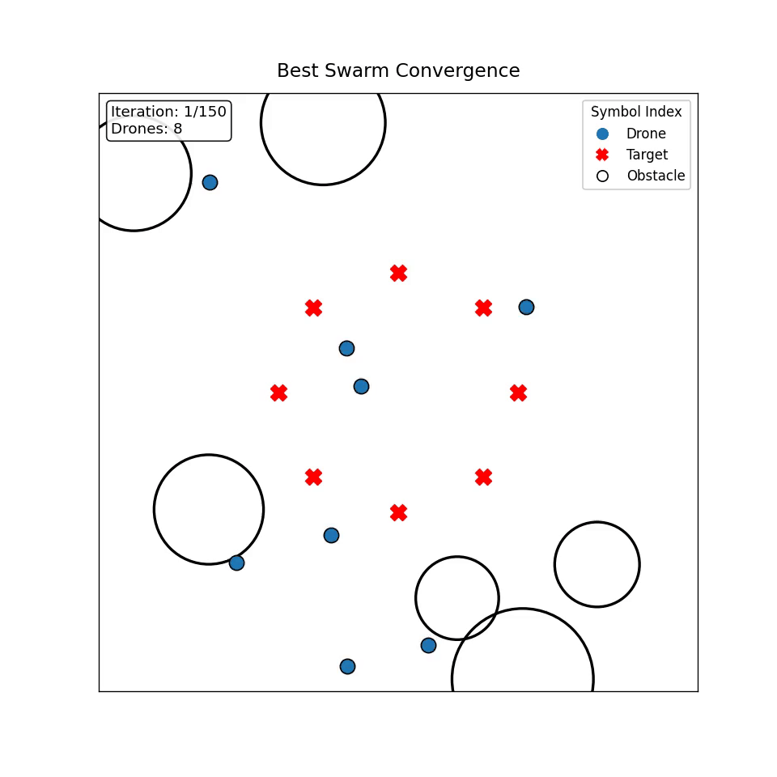

# Drone Swarm Optimisation System

This project implements an artificial swarm intelligence system for multi-drone formation control using Particle Swarm Optimisation (PSO).  
A swarm of drones autonomously converges to a circular target formation while avoiding obstacles in a bounded 3D environment.

---

## Overview

Each PSO particle represents a full swarm configuration.  
The optimiser iteratively updates drone positions to minimise:

- formation error relative to target geometry  
- inter-drone collision risk  
- obstacle penetration  
- displacement / energy cost  

The result is a stable circular formation achieved through decentralised swarm optimisation.

---

## Features

- Multi-drone swarm simulation  
- PSO-based formation optimisation  
- Circular target formation generation  
- Obstacle avoidance constraints  
- Convergence animation with labels  
- Visualisation of drones, targets, and obstacles  

---

## Results

The swarm converges rapidly to a safe circular configuration while maintaining separation and obstacle clearance.

<p align="center">
  
</p>

[Watch full video](outputs/best_swarm.mp4)


## Dataset

Environment configuration and swarm initialisation data are stored in:

data/


The notebook loads data using relative paths, so the project runs outside Kaggle without modification.

---

## Project Structure

drone_swarm_optimisation/
│
├── drone_swarm_pso.ipynb # PSO simulation and optimisation
│
├── data/ # Dataset / environment parameters
│
├── outputs/
│ ├── best_swarm.mp4 # Convergence video
│ └── best_swarm.gif # GIF preview
│
├── src/
│ └── visualization/
│ └── render_best_swarm.py # Swarm animation renderer
│
└── README.md


---

## Method

Each particle encodes a swarm configuration:

particle = [drone₁(x,y,z), … drone₈(x,y,z)]


PSO update:

v ← w·v + c1(pbest − pos) + c2(gbest − pos)
pos ← pos + v


Fitness combines:

- formation error  
- collision penalty  
- obstacle penalty  
- displacement cost  

---

## Usage

### Install dependencies

pip install numpy matplotlib moviepy


### Run simulation

Open and run:

drone_swarm_pso.ipynb


### Render convergence animation

```python
from src.visualization.render_best_swarm import render_best_swarm

render_best_swarm(gbest_history, target_positions, obstacles)
Applications
Swarm robotics

Autonomous drone coordination

Multi-agent optimisation

Formation control research

Author
Aditya Kapile
MSc Robotics and Intelligent Systems 
Nottingham Trent University.
